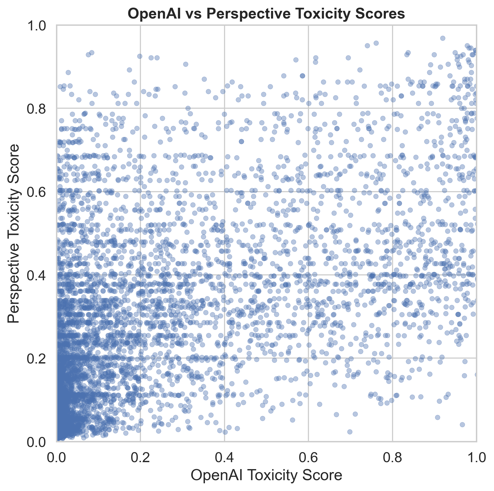
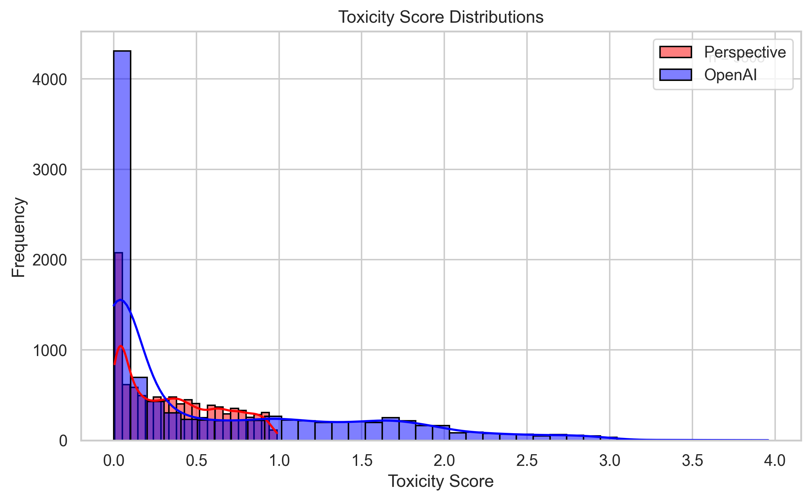

# 4chan Toxicity Analysis  


 

## 📖 Project Overview
This repository presents a **complete research pipeline** for analyzing toxic speech patterns on 4chan’s politically incorrect board (/pol/). The system combines two widely used automated moderation frameworks:  

- **OpenAI Moderation API** (context-sensitive, neural moderation)  
- **Google Perspective API** (linguistic toxicity scoring across categories)  

The pipeline was designed to demonstrate **end-to-end research competencies**: ethical data collection, API integration, quantitative analysis, visualization, and reproducible reporting.

---


## 📁 Repository Structure
```
4chan-toxicity-analysis/
├── data/
│   ├── pol_posts_raw.json
│   ├── pol_posts.json
│   └── pol_posts_with_scores.json
│
├── src/
│   └── main.py
|   └── data_collection.py           
|   └── processing.py                
|   └── api_integration.py
│   └── analysis.py        
│
├── results/                          # Visual outputs from analysis
│   ├── correlation_heatmap.png
│   ├── agreement_matrix.png
│   ├── confusion_matrix.png
│   ├── toxicity_distributions.png
│   ├── openai_toxicity_distribution.png
│   ├── openai_hate_distribution.png
│   ├── openai_sexual_distribution.png
│   ├── openai_self-harm_distribution.png
│   ├── openai_violence_distribution.png
│   ├── openai_harassment_distribution.png
│   ├── openai_harassment_threatening_distribution.png
│   ├── openai_hate_threatening_distribution.png
│   ├── openai_self-harm_intent_distribution.png
│   ├── openai_sexual_minors_distribution.png
│   ├── openai_violence_graphic_distribution.png
│   ├── persp_toxicity_distribution.png
│   ├── persp_identity_attack_distribution.png
│   ├── persp_insult_distribution.png
│   ├── persp_threat_distribution.png
│   ├── persp_severe_toxicity_distribution.png
│   ├── persp_obscene_distribution.png
│   ├── persp_profanity_distribution.png
│   ├── persp_sexually_explicit_distribution.png
│   ├── persp_spam_distribution.png
│   ├── persp_flirtation_distribution.png
│   ├── scatter_toxicity.png
│
├── tables/
│   ├── disagreement_by_op.csv
│   ├── disagreement_by_country.csv
│   ├── disagreement_by_op.md
│   ├── disagreement_by_country.md
│   └── precision_recall_table.md
│   └── precision_recall_table.md
│
├── summary/
│   └── analysis_summary.json
├── 4chan_toxicity_research_report_Muhamed_Muminul_Hoque.pdf
├── README.md
├── LICENSE
├── requirements.txt
├── .gitignore
│
```
---

## ⚙️ Setup Instructions

### 1. Clone the repository
```bash
git clone https://github.com/muminul-hoque/4chan-toxicity-analysis.git
cd 4chan-toxicity-analysis
```
## 2. Configure API keys:
Create a .env file in the root directory:
```env
OPENAI_API_KEY=your_openai_api_key
PERSPECTIVE_API_KEY=your_google_perspective_api_key
```
### 3. Create a virtual environment
#### For Linux/macOS:
```bash
python3 -m venv venv
source venv/bin/activate
```
#### For Windows:
```
python -m venv venv
venv\Scripts\activate
```
## 4. Install dependencies:
```
pip install -r requirements.txt
```

## 5. Run the pipeline:
```
python src/main.py
```
## 📊 Methodology  

### 🔹 Data Collection  
- Scraped **5,000–10,000 posts** from `/pol/` using 4chan’s JSON API  
- Implemented **rate limiting (1 request/sec)** and **duplicate filtering**  
- Stored structured JSON for reproducibility  

### 🔹 Preprocessing  
- Removed **HTML tags** and normalized whitespace  
- Filtered trivial/empty comments (<10 chars)  
- Produced a curated dataset ready for moderation scoring  

### 🔹 API Integration  
- Queried **OpenAI Moderation API** and **Google Perspective API**  
- Extracted toxicity scores across multiple dimensions (**hate, harassment, sexual, threats, profanity**)  
- Implemented **retry logic, error handling, and checkpointing**  

### 🔹 Comparative Analysis  
- Performed **Pearson & Spearman correlations**  
- Built **agreement/disagreement matrices**  
- Generated **category-wise toxicity distributions**  
- Applied **statistical significance tests**  

---

## 🔍 Research Questions  
- How consistent are OpenAI and Perspective in detecting toxic speech?  
- Which categories show the **largest disagreement**?  
- Do the systems capture **different toxicity dimensions**?  
- What methodological challenges arise when combining moderation APIs?  


---
##  Key Results
- Strong correlation between OpenAI and Perspective toxicity scores: Pearson’s r = 0.745, Spearman’s ρ = 0.820.
- Highest disagreement rates in India (31.25%), Costa Rica (26.67%), and Norway (23.33%).
- OP posts show higher disagreement (20.9%) than replies (17.85%).





*Figure: Distribution of toxicity scores for both APIs. Perspective shows a heavier tail toward high scores, while OpenAI’s distribution is more centered, indicating calibration differences.*


## Generative AI Usage  
This project used **Microsoft Copilot** and **OpenAI ChatGPT** for:  
- Debugging assistance  
- Documentation drafting  
- Statistical workflow suggestions  

All AI outputs were **reviewed and validated**. Analysis, interpretation, and reporting are **original work**.  

---

## Ethics & Privacy  
- Data collected from **public 4chan endpoints** following platform rules  
- No private user data accessed or stored  
- Toxicity analysis conducted **solely for research**  
- API keys and credentials are **excluded from version control**  

---
## Acknowledgements
- This project was inspired by Professor Kai-Cheng Yang. All implementation and analysis were conducted independently.

## Contact
For questions or collaboration, please reach out via email:  
**yang3kc@gmail.com** **muminul951@gmail.com**
